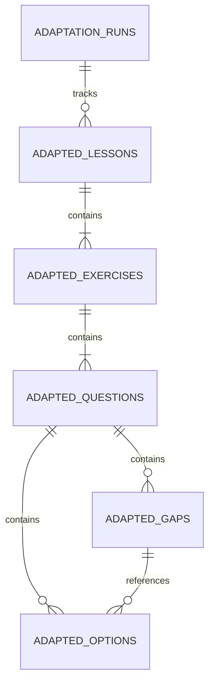
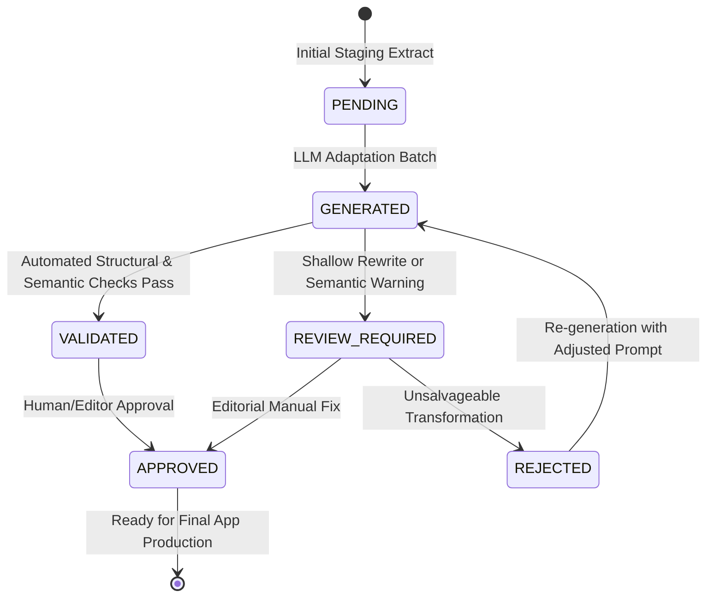
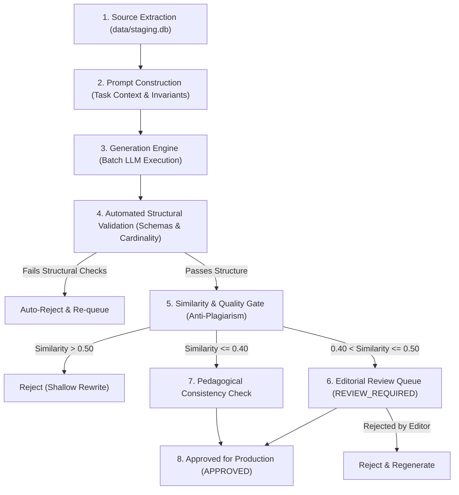

# TASK-010B: CONTENT ADAPTATION PIPELINE SPECIFICATION

## 1. EXECUTIVE SUMMARY & CORE PRINCIPLE

The purpose of the Content Adaptation Pipeline is to transform the acquired, parsed, and answered source corpus into **our own original, legally compliant, pedagogically equivalent English learning content**.

### 1.1 Core Principle

```
SOURCE CORPUS (Immutable)
    ↓
ADAPTATION LAYER (Relational Traceability)
    ↓
OUR ORIGINAL CONTENT (Substantive Rewrite)
    ↓
FINAL APP CONTENT (Preview Gate / Production)
```

The adaptation pipeline ensures that **every adapted question preserves 100% of the educational and grammatical value** of the original question while utilizing **independently created situations, characters, context, syntax, and distractor sets**.

### 1.2 Immutability Contract

The source corpus files and database tables are strictly read-only and immutable:
- `data/staging.db` (staging tables)
- `data/cms/english_cms_final_enriched.xlsx`
- `data/cms/universal_lessons_final_enriched.json`
- `data/cache/html/*.html`

The adaptation pipeline writes strictly to a dedicated adaptation layer (`adapted_*` tables or `data/adaptation.db`). Source records are never overwritten or deleted.

---

## 2. INVARIANTS VS. VARIABLES (WHAT IS PRESERVED VS. WHAT MAY CHANGE)

To maintain pedagogical validity while ensuring original authorship, the pipeline defines clear boundaries between invariant pedagogical attributes and adaptable surface narrative.

| Dimension | Classification | Detailed Rule |
| :--- | :--- | :--- |
| **Lesson / Topic Taxonomy** | **INVARIANT** | Must map to the exact same grammatical category (e.g. `past_simple_vs_past_continuous`). |
| **CEFR Level** | **INVARIANT** | Target CEFR level (`A1` through `C1`) must remain identical. |
| **Grammatical Target** | **INVARIANT** | The grammatical structure being tested (e.g. third-person `-s`, irregular past form, inversion after negative adverbials) must remain identical. |
| **Response Model** | **INVARIANT** | `gap` (select/text), `single_choice`, and `multiple_choice` must NOT be changed. |
| **Gap Cardinality** | **INVARIANT** | If the source question has 1 gap, the adapted question must have exactly 1 gap. Multi-gap questions must preserve the exact gap count. |
| **Option Cardinality** | **INVARIANT** | If source choice has 3 options, adapted must have 3 options. Number of correct options must remain identical (e.g. exactly 1 for `single_choice`, exactly 2 for `multiple_choice`). |
| **Truth Semantics** | **INVARIANT** | The logic making an option correct or incorrect must be preserved. |
| **Characters & Names** | **VARIABLE** | Names of people, pets, or personas must be completely replaced. |
| **Locations & Settings** | **VARIABLE** | Cities, countries, domestic/workplace/academic environments should be varied. |
| **Narrative Situation** | **VARIABLE** | The surface topic (e.g. talking about cinema vs. talking about gardening) should be reimagined. |
| **Non-Target Vocabulary** | **VARIABLE** | Nouns, adjectives, and incidental verbs not tied to the target grammar must be varied. |
| **Distractor Narratives** | **VARIABLE** | Distractors must be rewritten to match the new sentence context while maintaining the same grammatical error patterns. |

---

## 3. DATA MODEL & STORAGE ARCHITECTURE

The adaptation data model is maintained in [`schemas/adaptation_schema.sql`](file:///c:/projects/English%20Breakfast%20Grammar/schemas/adaptation_schema.sql) and is separated into dedicated relational entities.

### 3.1 Entity Relationship Diagram



### 3.2 Schema Definition

```sql
-- Core adapted question schema
CREATE TABLE adapted_questions (
    adapted_question_id TEXT PRIMARY KEY,
    source_question_id TEXT NOT NULL,
    adapted_exercise_id TEXT NOT NULL REFERENCES adapted_exercises(adapted_exercise_id) ON DELETE CASCADE,
    adapted_lesson_id TEXT NOT NULL REFERENCES adapted_lessons(adapted_lesson_id) ON DELETE CASCADE,
    question_order INTEGER NOT NULL,
    response_model TEXT NOT NULL,                      -- 'gap', 'single_choice', 'multiple_choice'
    source_text TEXT NOT NULL,
    adapted_text TEXT,
    explanation TEXT,
    difficulty TEXT,
    similarity_score REAL,                             -- Jaccard/Levenshtein similarity to detect shallow rewrites
    adaptation_status TEXT NOT NULL DEFAULT 'PENDING', -- PENDING, GENERATED, VALIDATED, REVIEW_REQUIRED, APPROVED, REJECTED
    review_required INTEGER NOT NULL DEFAULT 0,        -- 0 = False, 1 = True
    adaptation_notes TEXT,
    adapted_by TEXT,
    adapted_at TEXT
);
```

### 3.3 Lifecycle Status Flow



- **`PENDING`**: Source question queued for adaptation; adapted fields are NULL.
- **`GENERATED`**: Draft text and options produced by adaptation generator.
- **`VALIDATED`**: Passed all structural, syntactic, cardinality, and similarity threshold checks.
- **`REVIEW_REQUIRED`**: Flagged by automated heuristics (e.g. similarity $> 0.60$, ambiguous distractor, or naturalness warning).
- **`APPROVED`**: Confirmed by pedagogical editor as original and educationally sound.
- **`REJECTED`**: Fails criteria; scheduled for re-generation with specific feedback.

---

## 4. RULES BY RESPONSE MODEL

### 4.1 Gap Questions (`gap`)

1. **Placeholder Consistency**:
   - In database and CMS: `{{gap_1}}`, `{{gap_2}}`, etc.
   - On export boundary to Universal JSON: normalized to `{{gap1}}`, `{{gap2}}`.
   - Text must have an exact 1:1 match between placeholder tokens in `adapted_text` and child `adapted_gaps`.
2. **`input_control = 'select'` (Dropdowns)**:
   - Must have child options in `adapted_options`.
   - Exactly **1 option** must have `adapted_is_correct = 1`.
   - `adapted_correct_answer` must equal the `text` or `value` of the single correct option.
   - Distractors in the select dropdown must represent plausible grammatical mistakes relevant to the rule (e.g. wrong tense, wrong preposition, wrong inflection).
3. **`input_control = 'text'` (Fill-in Text)**:
   - Must NOT have child options.
   - `adapted_correct_answer` must be non-empty and natural for the gap.
   - `adapted_accepted_answers` must be a valid JSON array containing the canonical answer plus valid contracted or alternative spelling forms (e.g. `["do not", "don't"]`).

### 4.2 Single Choice Questions (`single_choice`)

1. **Option Cardinality**:
   - Exactly the same number of options as the source question (typically 3 or 4).
   - Zero gaps allowed (`gap_id` must be empty).
2. **Correctness Cardinality**:
   - Exactly **one option** must have `adapted_is_correct = 1`.
   - All other options must have `adapted_is_correct = 0`.
3. **Distractor Quality**:
   - Distractors must isolate the same grammatical distractor patterns as the original (e.g. if the original contrasts `Present Simple` vs `Present Continuous`, the adapted question must contrast the same two tenses, not introduce unrelated lexical traps).

### 4.3 Multiple Choice Questions (`multiple_choice`)

1. **Option Cardinality**:
   - Exactly the same number of total options as source (typically 3 or 4).
2. **Correctness Cardinality**:
   - Exactly the same number of correct choices as the source (in the Test-English corpus, all 165 multiple choice questions have **exactly 2 correct options**).
   - All correct options must be grammatically sound completions or answers in the new context.
   - Distractors must be indisputably incorrect under standard English grammar.

---

## 5. RULES FOR PRESERVING ANSWER SEMANTICS

When rewriting a question, the linguistic premise enabling the correct answer must be actively designed into the adapted sentence:

1. **Time Markers & Triggers**:
   - If the source depends on a specific temporal adverbial (e.g. `yesterday`, `since 2018`, `right now`, `at the moment`), the adapted sentence must provide an equivalent temporal trigger (e.g. `last weekend`, `for six months`, `currently`).
2. **Collocational Targets**:
   - If the tested target is a preposition following a verb/adjective (e.g. `depend on`, `interested in`), the adaptation must test a corresponding prepositional collocation appropriate for the topic level.
3. **Modal Nuances**:
   - If the source tests obligation vs. deduction (e.g. `must` vs. `have to` vs. `must be`), the adapted context must provide clear situational clues preventing ambiguity.
4. **Pronoun & Agreement Consistency**:
   - Subject-verb agreement must be maintained unambiguously (e.g. singular subject requiring third-person singular `-s`).

---

## 6. RULES & HEURISTICS FOR DETECTING INSUFFICIENT TRANSFORMATION

To guarantee genuine originality and eliminate plagiarism or surface-only paraphrasing, every generated adaptation is subjected to an automated **Transformation Quality & Anti-Plagiarism Engine**.

### 6.1 Similarity Thresholds

For each pair of `(source_text, adapted_text)`:

1. **Jaccard Token Similarity (excluding grammar target tokens)**:
   $$\text{Jaccard}(S_{\text{non-target}}, A_{\text{non-target}}) = \frac{|S \cap A|}{|S \cup A|} \le 0.40$$
   - If $\text{Jaccard} > 0.50$: **AUTOMATIC REJECTION** (Too close to original).
   - If $0.40 < \text{Jaccard} \le 0.50$: Flagged as **`REVIEW_REQUIRED`**.
2. **N-gram Shingle Overlap**:
   - No verbatim sequence of **3 or more consecutive non-target content words** (nouns, adjectives, lexical verbs) from the source may appear in the adapted sentence.
3. **Levenshtein Distance Ratio**:
   - Normalized Levenshtein similarity between non-target content must be $< 0.45$.

### 6.2 Disallowed Transformation Patterns

The engine rejects adaptations that exhibit:
- **Trivial Synonym Replacement**: Merely swapping `car` for `automobile` or `John` for `Peter` while preserving identical syntactic clauses.
- **Trivial Reordering**: Merely moving a time adverbial from the end of the sentence to the beginning without rewriting the clause.
- **Accidental Clue Giving**: Including the target answer word elsewhere in the instruction or sentence.
- **Unnatural Register**: Fabricating awkward or archaic sentences simply to achieve low similarity metrics.

---

## 7. WORKFLOW: SOURCE → GENERATE → VALIDATE → REVIEW → APPROVE



1. **Source Extraction**: Reads immutable question, gaps, and options from `data/staging.db`.
2. **Prompt Construction**: Injects:
   - Lesson topic and CEFR level;
   - Target grammar point;
   - Source sentence and options (as reference only);
   - Invariant constraints (gap count, option count, correct answer semantics);
   - Explicit instructions on required narrative transformation.
3. **Generation Engine**: Generates adapted item with clean JSON output.
4. **Automated Structural Validation**: Asserts:
   - Valid JSON;
   - Exact gap count match;
   - Exact option count match;
   - Single choice has exactly 1 correct; multiple choice has matching correct count.
5. **Similarity Gate**: Computes Jaccard/Levenshtein scores and assigns status (`VALIDATED` vs `REVIEW_REQUIRED`).
6. **Editorial Review**: Human-in-the-loop review interface for flagged items.
7. **Approval & Production Staging**: Marked `APPROVED` and ready for compilation into production SQLite and Universal JSON.

---

## 8. ROLLBACK STRATEGY & SOURCE TRACEABILITY

1. **Foreign Key Mapping**:
   Every adapted question preserves `source_question_id`. At any moment, any adapted question can be compared against its exact source in `data/staging.db` or `universal_lessons_final_enriched.json`.
2. **Selective Rollback**:
   An individual exercise, topic, or question can be reverted to `PENDING` without affecting any other part of the corpus.
3. **Full System Fallback**:
   Because `data/staging.db` and `data/cms/english_cms_final_enriched.xlsx` are completely independent and immutable, the system can instantly revert to the source checkpoint if needed.

---

## 9. TEST & VERIFICATION STRATEGY

1. **Schema & Model Tests**:
   - Verify table creation, foreign keys (`PRAGMA foreign_keys = ON;`), and constraints in SQLite.
2. **Invariance Tests**:
   - Assert that for every record in `adapted_questions`, its `response_model`, gap count, and option count match its `source_question_id`.
3. **Similarity Evaluator Unit Tests**:
   - Unit tests covering identical text, shallow synonym substitution, and properly transformed sentences to confirm accurate flagging.
4. **Preview Gate Integration**:
   - Convert adapted records into Universal Lesson JSON format and feed directly through `checkPreviewGate` from `src/preview/server.js` with `allowUnresolved: false`.

---

## 10. REUSE OF EXISTING PROJECT COMPONENTS

The adaptation pipeline maximizes reuse of already implemented and tested modules in this repository:

| Existing Component | Location | Role in Adaptation Pipeline |
| :--- | :--- | :--- |
| **Universal Content Models** | [`src/models/index.js`](file:///c:/projects/English%20Breakfast%20Grammar/src/models/index.js) | Instantiates canonical `Lesson`, `Exercise`, `Question`, `Gap`, and `Option` objects. |
| **Universal Validator** | [`src/validation/index.js`](file:///c:/projects/English%20Breakfast%20Grammar/src/validation/index.js) | Enforces strict validation (`allowUnresolved = false`) on adapted lessons before approval. |
| **Preview Server & Gate** | [`src/preview/server.js`](file:///c:/projects/English%20Breakfast%20Grammar/src/preview/server.js) | Verifies that adapted lessons render cleanly in the interactive student test engine. |
| **CMS-to-JSON Bridge** | [`pipeline/cms/excel_to_json.py`](file:///c:/projects/English%20Breakfast%20Grammar/pipeline/cms/excel_to_json.py) | Reconstructs accepted answers, normalizes `{{gap_1}}` $\to$ `{{gap1}}`, and maps types. |
| **CMS Validator** | [`pipeline/validators/cms_validator.py`](file:///c:/projects/English%20Breakfast%20Grammar/pipeline/validators/cms_validator.py) | Validates exported adapted Excel workbooks across all 12 structural checks. |
| **Staging Importer & DB** | [`pipeline/staging/staging_importer.py`](file:///c:/projects/English%20Breakfast%20Grammar/pipeline/staging/staging_importer.py) | Provides the proven relational database architecture and transaction handling patterns. |

---

## 11. NEXT IMPLEMENTATION STEPS (FOR FUTURE EXECUTION)

When authorized to begin implementation, the execution steps will be:

1. **TASK-011A**: Implement `pipeline/adaptation/similarity_evaluator.py` and unit tests for transformation metrics.
2. **TASK-011B**: Implement `pipeline/adaptation/adaptation_db.py` to initialize `data/adaptation.db` and populate initial `PENDING` records mapped from `data/staging.db`.
3. **TASK-011C**: Implement batch adaptation generator / workbook builder for controlled pilot execution (e.g. 20 exercises in level A1).
4. **TASK-011D**: Review pilot results, verify anti-plagiarism metrics, and finalize production adaptation prompt templates.
